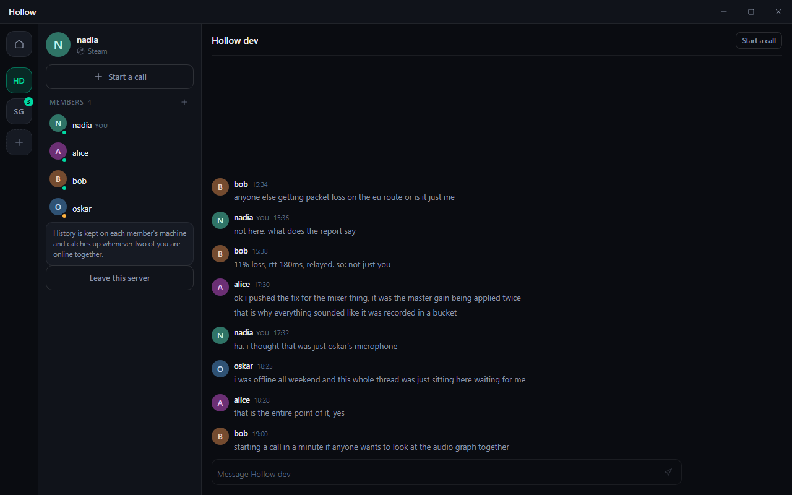
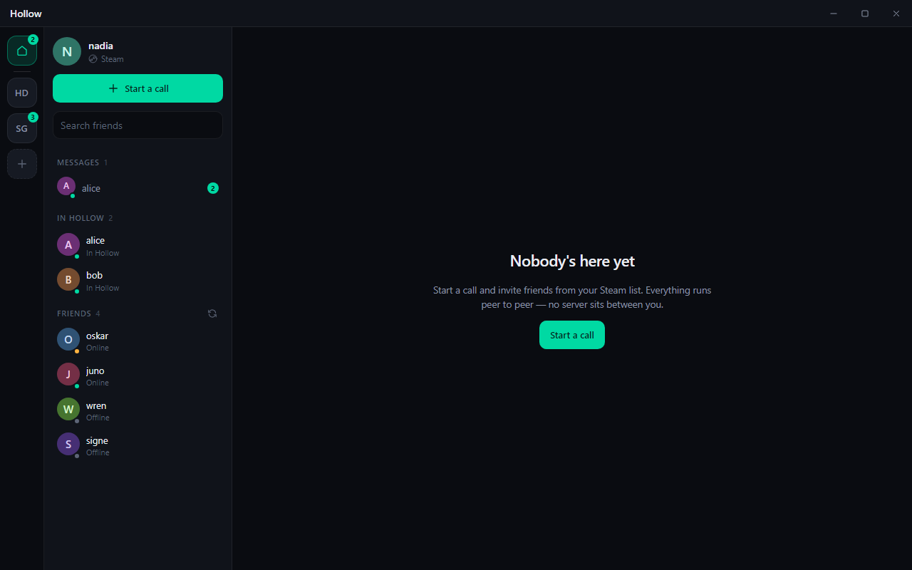
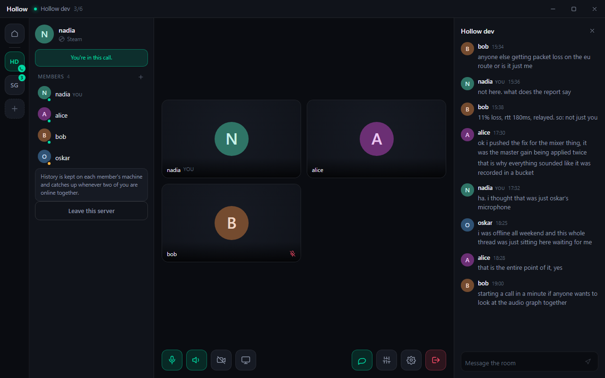

# Hollow

**Talk to your Steam friends. Nothing in the middle.**

Servers, chat, calls and file transfer between people who already know each other — carried directly between machines, over the connection Steam already gives you. There is no Hollow account, no Hollow server, and no Hollow company holding your conversations.



---

## The idea

Every group chat you use works the same way: your words go to a company's machine, and the company sends them on. That machine is what makes history work, and it is also what makes the whole thing somebody else's.

Hollow takes the other route. Your Steam account is your identity, your Steam friends list is your contact list, and Steam's peer-to-peer transport — which already solves NAT traversal and already authenticates both ends — carries everything. **Nobody stores your conversation except the people in it.**

That is a real trade, not a slogan, and the cost is stated in [Known limits](#known-limits).

---

## What you can do

### Servers

A permanent space with a member list, a chat that is kept, and a call. Keep it simple on purpose: **one text chat and one call per server**, no channel trees to arrange.

The history lives in a database on every member's machine and reconciles between them — see [How history works](#how-history-works-without-a-server).

### Direct messages, and sending someone a file

One-to-one chat with any Steam friend, kept the same way. Hover a friend to send them files: **no call required**, which is what Hollow did before it could do anything else.



### Calls

Up to six people, full mesh, Opus audio with echo cancellation. Share a screen or a single window, and send what your machine is playing along with it — with a **per-application mixer** so you choose exactly which apps are heard, with live meters and per-app volume.

Start a call inside a server and its kept chat sits right beside it.



---

## How history works without a server

Nobody is in charge, so nobody can be asked what the conversation was. Instead everyone keeps all of it, and copies are reconciled directly.

Every message is identified by **its author and a counter only that author advances**. Catching up with somebody means sending them the highest counter you hold per person; they reply with whatever exceeds it. From that one idea:

- **No clock has to agree.** Timestamps only decide the order lines are read in. A peer with a wrong clock misplaces its own lines and can corrupt nothing.
- **Duplicates are free to handle.** The same message arriving twice — once pushed live, once again in someone's catch-up — is the same primary key, so it is stored once and shown once.
- **Order does not matter.** Frames can arrive in any sequence, from any member, after any interruption, and everyone converges on the same transcript.

Syncing happens when a member becomes reachable, because that is the only moment it can succeed.

---

## How it fits together

```
┌──────────────────────────────────────────────┐
│  Electron shell                              │
│  • React UI                                  │
│  • WebRTC mesh: audio, camera, screen        │
│  • Screen capture via desktopCapturer        │
└───────────────┬──────────────────────────────┘
                │  JSON-RPC over stdio  ·  PCM over a named pipe
┌───────────────┴──────────────────────────────┐
│  hollow-core (Rust)                          │
│  • hollow-steam  — identity, lobbies, P2P    │
│  • hollow-audio  — WASAPI capture and mixing │
│  • file transfer with flow control           │
│  • SQLite: servers, members, chat history    │
└──────────────────────────────────────────────┘
```

**Steam carries signaling, not media.** Lobby membership and WebRTC's SDP/ICE exchange ride Steam's authenticated peer channel, which already solves NAT traversal and falls back to Valve's relay network. Once peers have exchanged descriptions, audio and video negotiate their own direct path.

That split is deliberate: Steam gives us identity and a reliable control channel for free, and WebRTC gives us an encoder stack — congestion control, packet loss recovery, jitter buffering, echo cancellation — that would take years to reimplement.

### What is written down

One file: `%APPDATA%\Hollow\hollow.db`, holding your servers, their members and their chat. That is all.

Media is never recorded. And the chat inside a call that belongs to no server is still memory-only and still gone when the call ends — a throwaway lobby has no identity to hang a transcript on, and inventing one would mean inventing a server nobody asked for.

### Who is allowed to reach you

Talking to somebody outside a call means letting them open a peer session with no lobby to vouch for them, so Hollow keeps a list: **your Steam friends, and anyone sharing a server with you.** It is recomputed from scratch whenever either changes, so unfriending someone closes the door again. Anybody else is refused, and a file offer still has to be accepted before a single byte is written to disk.

---

## Audio: what works on which Windows

The per-application mixer has two modes, chosen automatically at startup. The app tells you which one it is using.

| Windows build | Mode | What muting an app does |
|---|---|---|
| **20348+** (Windows 11) | Per-process capture | Removes it from the broadcast only. You still hear it. |
| **Earlier** (incl. 10 22H2, build 19045) | System loopback | Changes the Windows session volume — so it also mutes locally. |

The API that captures a single process's audio (`ActivateAudioInterfaceAsync` with `AUDIOCLIENT_ACTIVATION_TYPE_PROCESS_LOOPBACK`) shipped in build 20348. There is no supported way to do it on earlier builds without installing an audio driver, so on those Hollow captures the whole endpoint and gives you the Windows volume mixer's own controls instead. The app list, icons and live meters work identically in both modes.

---

## Building

Windows only for now. The audio engine is built directly on WASAPI.

### Prerequisites

- Rust (stable) and Node 20+ to build
- **A running Steam client** to use it. That's the whole list.

There is no SDK to download and no environment variable to set. The `steamworks-sys` crate vendors the Steamworks SDK.

```bash
cargo build --release
```

Cargo leaves Valve's redistributable in the build-script output rather than next to the binary, so stage it once:

```powershell
Copy-Item (Get-ChildItem target/release/build/steamworks-sys-*/out/steam_api64.dll | Select-Object -First 1).FullName target/release/
```

Without it the daemon exits immediately and the app shows only the fatal-error pane.

Hollow uses app id **480** (Spacewar, Valve's public test app), which gives working friends, lobbies and P2P between real Steam accounts. Override it with `HOLLOW_STEAM_APP_ID` if you register your own.

If Steam isn't running, Hollow starts anyway with placeholder peers and says so in the sidebar, so the interface can be worked on without it.

### Desktop app

```bash
cd desktop && npm install && npm run dev
```

`npm run dev` expects `hollow-core` in `target/release` or `target/debug`. To produce an installer:

```bash
cd desktop && npm run dist
```

### Tests

```bash
cargo test -p hollow-core
```

The suite covers the part that has to be right and cannot be checked by eye: the version-vector reconciliation, deduplication, scrollback paging across tied timestamps, and a full two-peer round trip over real frames where one side was offline for the whole conversation.

---

## Known limits

- **History needs an overlap.** A message reaches you only while somebody who already holds it is online at the same time as you. Two people who are never online together never sync. Everyone present when it was said keeps a copy, so in practice any one of them is enough — but nothing stores it on your behalf, because there is nothing in the middle to do the storing.
- **Six participants.** Mesh means the person sharing their screen uploads one copy per viewer. Past six, a typical residential uplink cannot keep up, and there is no media server to fan out from.
- **Symmetric NAT needs TURN.** Steam gets the call set up regardless, but media negotiates independently and two peers behind strict NAT cannot find each other with STUN alone. Settings has a TURN field for that case; Hollow does not host one.
- **Per-process audio is untested.** It requires build 20348+, which the development machine does not run. The system-loopback path is the exercised one.
- **App id 480 is shared.** Spacewar is Valve's public test app, so lobbies live in the same pool as everyone else's experiments. Hollow stamps its lobbies and refuses to join anything unstamped, but registering your own app id is the real fix.

---

## Repository layout

| Path | What |
|---|---|
| `crates/hollow-core` | The daemon: RPC, orchestration, file transfer, servers and their SQLite history |
| `crates/hollow-steam` | Steam identity, lobbies, P2P messaging (real + mock) |
| `crates/hollow-audio` | WASAPI session enumeration, loopback capture, mixing |
| `crates/p2p-connection` | Standalone QUIC peer library — Hollow's original transport, kept as a reusable crate |
| `desktop` | Electron shell and React UI |
| `desktop/preview` | Renders the real UI against a stubbed daemon, to regenerate the screenshots above |

### About the screenshots

They are the real components and the real stylesheet, rendered by the same Chromium the app runs in — the people and conversations in them are invented, the way any product screenshot's demo data is. Regenerate them after a UI change with:

```bash
cd desktop && npx vite --config preview/vite.config.ts
```

then, in another terminal:

```bash
cd desktop && npx electron preview/capture.cjs
```

---

## License

MIT
